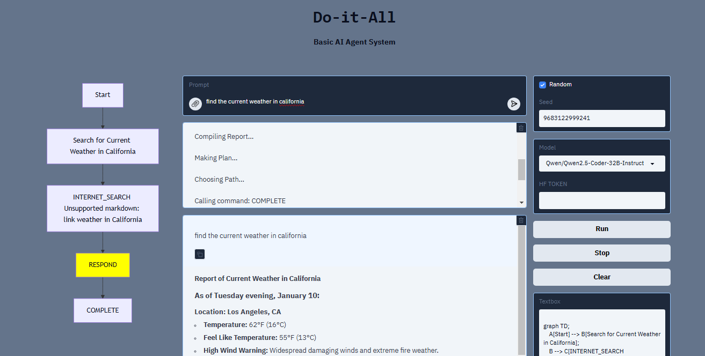

# Do It All


## Overview
The **Do It All** basic agent system for Python. It provides a framework for building automated AI agent scripts in Python using a variety of models and API's.

## Features
- Creates a path and follows it
- Internet Search
- Image Generation
- Normal Chatbot

## Usage

### 1. Clone the repository:
```bash
git clone https://github.com/broadfield-dev/doitall.git
```

### 2. Install dependencies:
```bash
pip install ./doitall
```

### 3. Run the demo script:
```bash
python doitall/demo.py
```
# TODO
- Add more model sources
- Document Reading
- RAG
- Screen Reading
- Console Control
- Screen Control

## License
This project is licensed under the MIT License - see the [LICENSE](LICENSE) file for details.
